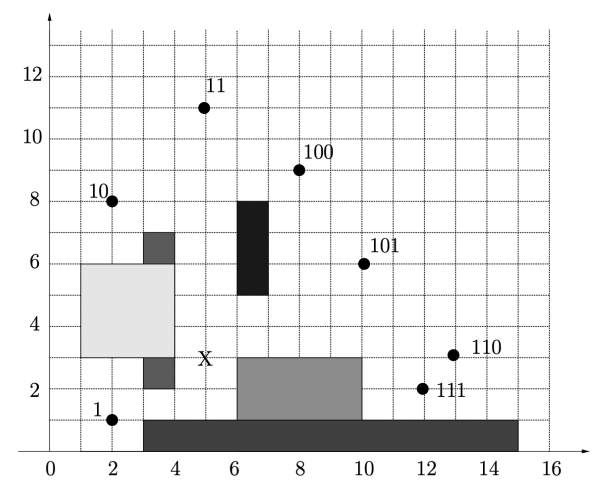

# Automi ed Ostacoli 🪨

La seguente repository contiene il progetto sviluppato nell'ambito del corso di Laboratorio di Algoritmi della professoressa Violetta Donati nell'anno accademico 24/25

Il progetto realizzato in Go gestisce un piano cartesiano contenente automi ed ostacoli

Nel file `progetto-gen2025-v4-9gen2025.pdf` sono presenti le specifiche del progetto e in `Relazione_23407A_Corrado_Francesco.pdf` è presente la relazione di esso

Le entità presenti nel progetto sono le seguenti:

### Automi

Puntiformi, possono spostarsi in un punto di richiamo

### Ostacoli

Impediscono il movimento agli auotmi

## Organizzazione

Il progetto è gestito nel seguente modo:

- All'interno della cartella `29407A_corrado_francesco` è presente il progetto:
    - `base.in` e `base.out` sono file di input per il testing
    - `formato_test.go` `lib_test.go` e `utils_test.go` sono files di testing
    - `29407A_corrado_francesco.go` è il main del progetto

- All'interno della cartella `filesTesting` sono presenti numerosi test di input con i relativi output per testare il progetto su vari aspetti

- All'interno della cartella `generatoreTest` è presente il file `generator.go` che serve per generare file di input personalizzati nel formato richiesto dal programma. I file generati sareanno salvati all'interno di `test_file.txt`

## Funzionalità

Il progetto passa tutti i test ed è perfettamente funzionante e permette di:

* Inserire nel piano automi ed ostacoli
* Spostare automi in un punto di richiamo se possibile
* Calcolare la tortuosità minima di un percorso

*Francesco Corrado 2025*